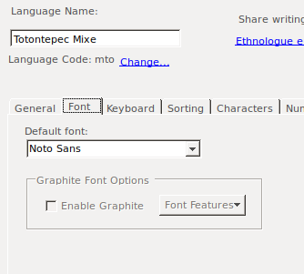

# flibl
a tool to bolster the transfer of texts between ELAN and FLEx (and FLEx and ELAN)

## Requirements
* Python 3.10.x+ (there are no extra dependencies that aren't already downloaded with Python)
* A project that has been already set up in FLEx
* files
    * `flexible.py`
    * `to_flextext_config.json`
    * `flextext_construction.py`
    * `to_eaf_config.json`
    * `eaf_construction.py`
    * An EAF file (if going from ELAN to FLEx)
    * A *morphologically parsed* FLExText file (if going from FLEx to ELAN)

## Warnings
* When setting up the config files, make sure to use quotation marks around all of the strings you type, except for the `0` or `1` you need to use for the `"kid"` parameter in `to_eaf_config.json`
* Ensure you're using the right version of Python by typing `python --version` into your terminal/command prompt. If it returns something beginning with `2.`, try running `python3 --version`. If either of those commands return something below `3.10`, please download a more recent version of Python [from their website](https://www.python.org/) and run `flibl` using that. (If `python --version` gives you something above `3.0` but below `3.10` and `python3 --version` gives you an error of some kind, you still need to download something more recent)
* When exporting your FLExText, ensure that you are exporting all of the information from the morphologically parsed text, as `flibl` includes as much as possible, so the user can decide what to exclude after getting it to ELAN.

## Use
Using `flibl` will involve opening configuration files in a text editor, such as gedit, textedit, or notepad. If you want something fancier, people often opt for something like [VSCode](https://code.visualstudio.com/), but it's not necessary. You will also need to run the scripts in Python, which involves opening a Terminal/Console window and typing `python ` or `python3 ` and then the name of the script.

### Going from ELAN to FLEx
Given an ELAN text that has been annotated to your satisfaction and is ready to go into FLEx, you can use `flibl` to transfer that text and keep some important information that would otherwise be lost.

1. Set up the configuration file. Open `to_flextext_config.json`. You can look at `to_flextext_config_example.json` for an example.
    * `file_names` should contain the relative or absolute paths to each file that will be processed when running this. I would advise only using one file at first just to make sure everything is working alright. Remember to check that the path is correct
    * `language_fonts` has information about the fonts that FLEx will need. For each language you need to provide the following information:
        * `lang`: the code used by FLEx to identify this language/script
        * `font`: the name of the font used in FLEx for this language
        * `vernacular`: either `"true"` or `"false"`, depending on whether this language is the one FLEx consdiers the "vernacular" language.
        For all of this information, go into FLEx and find it under Tools > Configure > Set up Vernacular/Analysis Writing Systems. You'll find the code under the General tab, and the font under the Font tab.
        


        
        
    * `languages` lists three languages relevant to this transfer process
        * `main_language`: the equivalent of FLEx's "vernacular" language, but more specifically is the code you are using for the language of study in FLEx
        * `child_language`: in the case that you have a system where you set up a different language for ungrammatical/child language, this is where you should put that code
        * `flex_language`: the language you have configured FLEx to use. For many of us Latin Americanists that will be English (`en`), Spanish (`es`), or Portuguese (`pt`)
    * `valid_characters` are the sets of written characters that are to be considered valid by FLEx and `flibl`. Write them using [Regular Expressions](https://developer.mozilla.org/en-US/docs/Web/JavaScript/Guide/Regular_Expressions/Cheatsheet). It is likely that one might use Unicode characters, and it will be best to use the unicode escapes, which are in the form `\u{######}` where the `#`s are hexadecimal digits. You'll need to make sure FLEx will consider all of these characters as word-forming and not punctuation, which can be adjusted in the Writing systems configuration in FLEx. Refer back to the screenshots above to get to the Vernacular Writing System Properties window and click on the Characters tab, then click on Valid Characters... . Use this interface to see which characters FLEx sees as valid for the "vernacular" language, (adjust it if you haven't before,) and use the Word Forming set at the top to make your Regular Expression for the configuration file. 
    Since a lot of writing systems use glottal stops marked by some kind of apostrophe-like symbol, but there's a ton that look similar but are indeed different, here's a bunch of apostrophes so you can allow all of them, just in case the wrong kind snuck into your text: '`ꞌꞋ'‘’. If you want to check the Unicode escape for a character, I recommend [this UniView app](https://r12a.github.io/uniview/index.html), where you can copy and paste a character into the box and see information about it, or go the other direction and start from information about a character like its Unicode block name or escape and see the character itself. Another option is thie [Unicode code converter](https://r12a.github.io/app-conversion/index.html) which also lets you go in both directions, and you can just type an entire string in whichever box is appropriate for what you're trying to do.
    * `exclude_tier_id` is a list of TIER_IDs to exclude from the import
    * `excldue_tier_type` is a list of LINGUISTIC_TYPEs to exclude from the import (if you want to wholesale exclude a type instead of going ID by ID)
    * `exclude_tier_constraint` is a list of CONSTRAINTSs found in LINGUISTIC_TYPEs if you want to exclude, e.g., all symbolic subdivisions
    * `translation_tiers` is a list of TIER_IDs which are to be included as translations in FLEx. The left side should be the TIER_ID in ELAN, and the right should be the language code in FLEx that it will correspond to
    * `target_utterance_tier_type` is a list of LINGUISTIC_TYPEs that should be considered target/ungrammatical utterances, so `flibl` knows to link them with their parents when they go into FLEx
2. Run `flibl`
    * Run the following
    ```shell
    ptyhon flextext_construction.py
    ```
    * If you are using a Mac, you will probably need to run it using
    ```shell
    python3 flextext_construction.py
    ```
    * There will be a new FLExText file in the same directory where your original EAF file was, with a long name that has the date and time of running `flibl`, to avoid confusion and version clashing if things go wrong or you need to redo/fix something.
3. Import the FLExText to your FLEx database
    * Within FLEx, open the Texts and Words pane
    * Click File at the top left > Import > FLExText Interlinear 
    * Navigate to your newly created file and choose it

### Going from FLEx to ELAN
Assuming you have a text that has been parsed to your satisfaction in FLEx, you can now export it and use `flibl` to ensure that it keeps important information as you open it in ELAN. If you have gone through the process of exporting from FLEx and importing to ELAN before, this will be slightly different, `flibl` foregoes the Import process in ELAN, and rather creates the EAF file for you.

1. Export the text from FLEx
    * From File, click Export Interlinear...
    * Choose to export as a FLExText (this should be the first option; the Format column will say "ELAN, SayMore, FLEx" and the Extention column will say "FLEXTEXT"
    * Choose all the files you wish to export
    * Select a place for them to be saved and export them
2. Set up the configuration file. Open `to_eaf_config.json`. You can look at `to_eaf_config_example.json` for an example.
    * `file_names` should contain the names of each file that will be processed when running this. I would advise only using one file at first just to make sure everything is working alright. Remember to check that the path is correct. A notable difference between this and the ELAN -> FLEx script is that you need to have the paths to both the original ELAN file *as well as* the new FLExText you just exported. This is so that metadata from the original ELAN file is maintained in the import.
        * `original_eaf`: path to the EAF that the FLExText originated from
        * `flextext`: path to the newly exported FLExText
    * `language` corresponds to code for what FLEx calls the "vernacular" language
    * `child_language` corresponds to code for what you may have used in FLEx as the language for child/ungrammatical utterances
    * `speakers` is a list of the speakers in the texts
        * The left side (key) of these should match the `name` inside the object (in {braces}) that it corresponds to
        * `name` (and the key, as mentioned above): code used for the speaker (should be the same as what we see in FLEx, which should have come from the original ELAN file; this is used to match up addressee as well as speaker)
        * `kid`: `1` if the speaker is a child or `0` if the speaker is not; in another framing, `1` would correspond to speakers who make ungrammatical utterances, so `flibl` knows to look for matchups of corresponding Phonetic/Target utterances
    * `translations` is a list of the language codes for the languages used for translation in FLEx
    * `languages` is a list of the languages used, with information needed by ELAN. Honestly, to save from confusion, it's helpful to keep them all the same. But if you have a system, please use it! It's mostly important for controlled vocabularies, which is assumed to be `unk` (unknown) anyways, and ELAN will default to filling it out as such.
        * `LANG_DEF`: reference for the language (often a URI)
        * `LANG_ID`: internal identifier for the language
        * `LANG_LABEL`: external label for the language
    * `xds` is a list of controlled vocabulary items for X-directed speech. This is what `flibl` looks for when scouring for extra notes in the FLExText to add a tier for XDS
3. Run `flibl`
    * Run the following
    ```shell
    ptyhon eaf_construction.py
    ```
    * If you are using a Mac, you will probably need to run it using
    ```shell
    python3 eaf_construction.py
    ```
    * The terminal window will fill up with numbers, this is just noting the percentage of utterances that have been parsed by `flibl`, so you can see the progress.
    * If you want to also export a JSON representation of the file, you can add a flag to do so. It will create a JSON file with the same name that you can use and manipulate in other programs and scripts, much more easily than a very specific FLExText or EAF XML format:
    ```shell
    python eaf_construction.py -j
    ```
    or, on Mac
    ```shell
    python3 eaf_construction.py -j
    ```
4. Open it in ELAN just like you would open any other EAF file.

Hooray! You now have created an EAF file that has the results of parsing in FLEx, re-associating ungrammatical and grammatical utterances, and with all the note tiers appropriately settled where you wanted them. Just sort by date to see which one was most recently made in the source folder where you kept your FLExText, and you'll see it. It will have an even longer title, with the date and time you used `flibl` to create this file (so it will have the date and time of both import and export if you used `flibl` in both directions) for the same reason as above--i.e., in case something goes wrong or you need to edit something and redo the export. You'll be able to open that file directly in ELAN without a formal import--it maintains the link to media it originally had, too, so you don't need to set that up.